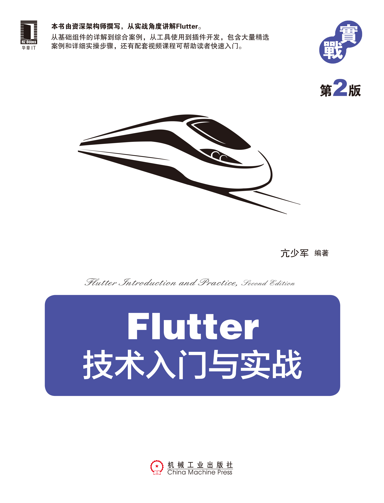
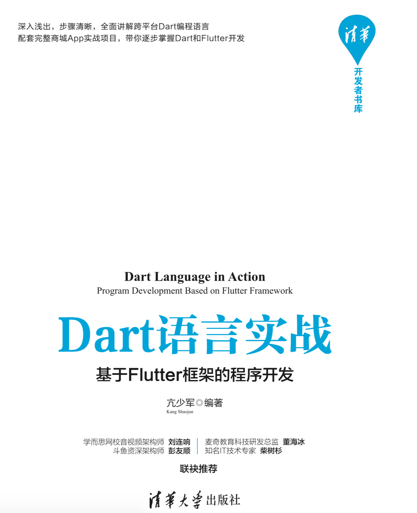

资深开发者，创业者。专注于视频通讯技术领域。国内首本Flutter著作《Flutter技术入门与实战》作者,另著有《Dart语言实战》及《WebRTC音视频开发》等书籍。多年从事视频会议、远程教育等技术研发，对于Android、iOS以及跨平台开发技术有比较深入的研究和应用，作为主要程序员开发了多个应用项目，涉及医疗、交通、银行等领域。

## WebRTC音视频开发 React+Flutter+Go实战

## Flutter技术入门与实战 第2版

## Dart语言实战 基于Flutter框架的程序开发
